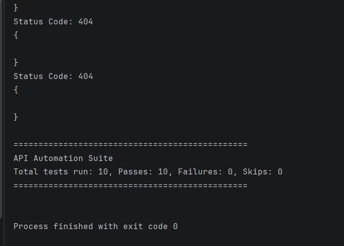

# API Test Automation Framework

## Project Overview

This project is a Java-based API test automation framework built using REST Assured and TestNG. 

The framework automates API testing for GET, POST, PUT, and DELETE requests. It also includes data-driven testing, negative testing, reusable validation utilities, external JSON test data, and centralized endpoint management.

The project uses JSONPlaceholder as the REST API under test.

## Technologies used

-Java
-REST Assured
-TestNG
-Maven
-JSON
-IntelliJ IDEA
-Git & GitHub

## Framework Structure

```text
src
├── main
│   └── java
│       └── com
│           └── srushti
│               └── Main.java
│
└── test
    ├── java
    │   ├── base
    │   │   └── BaseTest.java
    │   │
    │   ├── endpoints
    │   │   └── Routes.java
    │   │
    │   ├── negative
    │   │   ├── InvalidCreatePostTest.java
    │   │   ├── InvalidEndpointTest.java
    │   │   └── InvalidPostTest.java
    │   │
    │   ├── tests
    │   │   ├── GetPostTest.java
    │   │   ├── CreatePostTest.java
    │   │   ├── DataDrivenPostTest.java
    │   │   ├── UpdatePostTest.java
    │   │   └── DeletePostTest.java
    │   │
    │   └── utils
    │       ├── ApiValidator.java
    │       └── JsonReader.java
    │
    └── resources
        ├── postData.json
        ├── postTestData.json
        └── updatePostData.json
pom.xml
testng.xml
README.md
```

##API Test Coverge

### GET
-Sends GET request to retrieve a post
-Validates HTTP status code
-Validates response fields

### POST
-Creat a new post
-Validates HTTP 201 Created response
-Validates response body fields

### PUT
-Updates an existing post
-Validates HTTP 200 response
-Validates updates response fields

### DELETE
-Deletes a post
-Validates HTTP response status

##Negative Testing

The framework includes negative test scenario to verify how the API behaves when invalid requests or endpoints are used.

Negative tests include:

-Invalid endpoints
-Invalid POST request
-Invalid post data

Expected HTTP error responses are validated using TestNG assertions.

## Data-Driven Testing

The framework uses TestNG `@DataProvider` to execute the same API test with multiple stes of input data.

Example test data includes:

-Multiple post titles
-Multiple post bodies
-Different user IDs

This allows the same test logic to be reused with different input values without duplication test methods.

## Reusable Framework Compenets

### Basetest

Provides centralized REST Assured configuration, inclding the API base URI.

### Routes

Stores API endpoints paths in one centralized class.

### ApiValidator

Provides reusable validation methods for:

- HTTP status codes
- String response fields
- Integer response fields

## JsonReader

Reads external JSON files and returns their contents as strings for use in API Resquests.

## Test Data
Eternal JSON files and returns their contents as strings for use in API requests.

```text
postData.json
postTestData.json
updatePostData.json
```

Keeping test data separate from test logic makes the framework easier to maintain and extend.

## TestNG Site

All tests are organized and executed through:

```text
tesrng.xml
```

The suite includes:

-Functional API tests
-Data-driven tests
-Negative tests

## Running the Tests

### Using IntelliJ IDEA

Run the `testng.xml` suite from IntelliJ IDEA.

### Using Maven

Run the complete test suite from the project root:

```bash
mvn test
```

## Test Reults

The complete TestNG suite currently executes successfully:

```text
Total tests run: 10
passes: 10 
Failures:0
Skips:0
```

## Skills Demonstated

This project demonstrates practical experience with:

-REST API testing
-API automation
-java
-REST Assured
-TestNG
-Data-driven testing
-Positive and negative testing
-JSON test data
-API response validation
-Reusable test unilities
-maven
-Git
-GitHub

## Test Execution Report

The complete TestNG suite was executed successfully with all tests passing.



